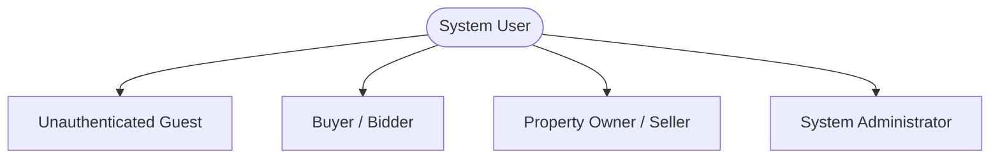
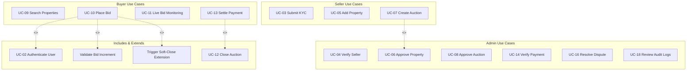
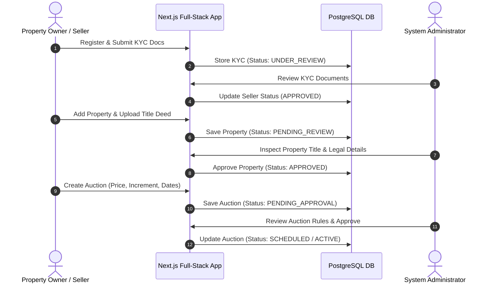
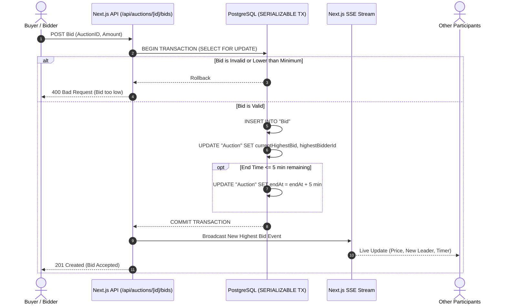
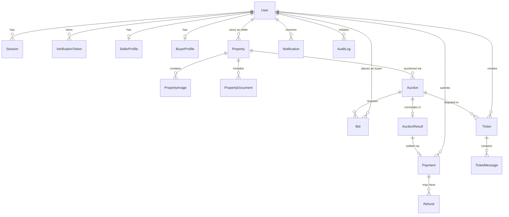
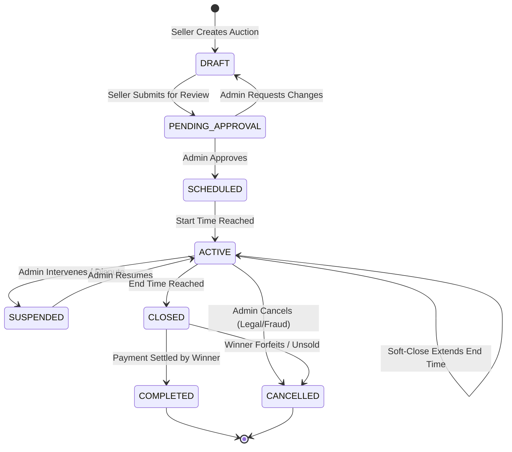
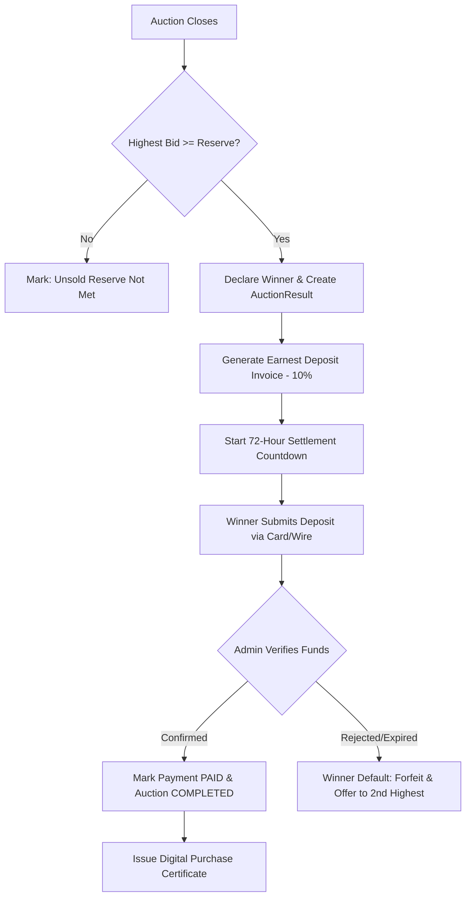

# Software Requirements Specification (SRS)
## Property Auction Management System

**Document Version:** 1.0.0  
**Status:** Approved Architectural Baseline  
**Framework Stack:** Next.js (App Router, Full-Stack), TypeScript, React 19, Tailwind CSS v4, Prisma ORM 7, PostgreSQL  
**Author:** Senior Software Architect, Business Analyst, Security Engineer, Full-Stack Team  

---

## 1. Introduction

### 1.1 Purpose
This Software Requirements Specification (SRS) establishes the complete functional, technical, non-functional, and architectural requirements for the **Property Auction Management System**. This document serves as the single source of truth for software engineers, database architects, QA engineers, UI/UX designers, and project stakeholders.

### 1.2 System Overview
The Property Auction Management System is a specialized, secure, high-concurrency web platform designed to facilitate the online auction of real estate assets. It provides property owners (Sellers) with a structured mechanism to list real estate and conduct transparent competitive bidding. It grants qualified buyers (Bidders) discovery, verification, and real-time bidding capabilities. The platform enforces strict regulatory compliance, administrative verification, and financial integrity through a centralized administrative dashboard.

### 1.3 Target Technology Ecosystem
The entire system is implemented as a **Full-Stack Next.js solution**:
- **Application Framework:** Next.js 16+ (App Router architecture for both presentation tier and backend REST API / Server Action tier).
- **Frontend Layer:** React 19 Server Components (RSC) and Client Components with Tailwind CSS v4 and dynamic state management.
- **Backend & Data Access:** Next.js Route Handlers (`app/api/**`) and Next.js Server Actions with Prisma ORM 7.
- **Persistence Tier:** PostgreSQL database with transactional integrity and connection pooling.
- **Real-Time Layer:** Server-Sent Events (SSE) / WebSocket route handlers for live bid stream distribution.

### 1.4 Definitions, Acronyms, and Abbreviations
- **SRS:** Software Requirements Specification
- **RBAC:** Role-Based Access Control
- **RSC:** React Server Components
- **SSE:** Server-Sent Events
- **ORM:** Object-Relational Mapping (Prisma)
- **KYC:** Know Your Customer (User and Owner identity verification)
- **Soft-Close / Anti-Sniping:** An auction mechanism that automatically extends the closing time if a bid is registered within the final minutes of an auction.
- **Reserve Price:** The confidential minimum threshold price at which the seller agrees to transfer the property.

---

## 2. System Purpose

The mission of the platform is:
> **To provide a trusted, transparent, secure, and legally auditable online marketplace where property owners can publish verified real estate for auction, while verified buyers place competitive bids in real time under deterministic auction rules until final settlement.**

### Core Tenets
1. **Transparency:** Every bid is registered with an immutable microsecond timestamp, verifiable bid progression, and clear public bid history.
2. **Security & Zero-Trust:** Rigorous identity verification (KYC), document sanitization, cryptographically hashed passwords, and end-to-end audit logging.
3. **Fairness:** Prevention of front-running, bid sniping, insider manipulation, and phantom bidding through automated validation rules and soft-close extensions.
4. **Traceability:** Complete lifecycle logging of every property status mutation, user interaction, bid placement, and financial settlement.
5. **Efficiency:** Instantaneous bid processing with zero race conditions using PostgreSQL transaction isolation and Next.js server-side concurrency handling.

---

## 3. Scope

### 3.1 In-Scope Capabilities
- **Identity & Access Management:** User self-registration, credential verification, multi-factor support, session token handling, and role segregation across Seller, Buyer, and Admin.
- **Seller Verification (KYC):** Government ID, business registration, and title deed ownership proof verification.
- **Property Lifecycle Management:** Detailed property profiling (geographical data, legal title, parcel IDs, dimensions, high-resolution media, inspection reports).
- **Auction Engine:** Starting price, minimum increment thresholds, scheduled start/end windows, soft-close anti-sniping logic, and state machine automation.
- **Real-Time Bidding Desk:** Live bid progression board, user bid placement validation, outbid alerts, and personal bid history.
- **Auction Settlement & Invoicing:** Automatic determination of winning bidder, reserve price validation, invoice generation, deposit/settlement transaction tracking.
- **Dispute & Complaint Tracking:** Ticket creation, document attachment, admin review, and resolution tracking.
- **System Governance & Reporting:** Financial ledgers, platform transaction fee calculation, audit log tracking, and exportable CSV/PDF reports.

### 3.2 Out-of-Scope (Phase 1)
- Autonomous physical title transfer at government land registries (platform provides digital title verification and settlement invoices; physical conveyance occurs off-platform or through notary integration in Phase 2).
- Native iOS/Android mobile apps (platform is built as a fully responsive Progressive Web App via Next.js).

---

## 4. Objectives

- **Operational Integrity:** Guarantee zero lost bids or race condition anomalies during high-concurrency bidding spikes.
- **Sub-Second Bid Processing:** Achieve sub-300ms end-to-end round trip for bid submission, validation, database commit, and SSE broadcast.
- **Data Verifiability:** Maintain an append-only, tamper-evident bid audit log.
- **Platform Scalability:** Support horizontal scalability using stateless Next.js server instances connected to managed PostgreSQL.
- **Regulatory Alignment:** Comply with digital real estate marketplace transparency regulations and GDPR/data privacy standards.

---

## 5. Stakeholders

| Stakeholder Group | Description | Primary Interest |
|---|---|---|
| **Property Owners / Sellers** | Individuals or legal entities listing real estate. | Maximizing fair market property value with minimal friction and verifiable buyers. |
| **Buyers / Bidders** | Verified individual or institutional investors. | Fair, transparent bidding environment with genuine property verification and instant bid feedback. |
| **System Administrators** | Platform operators, compliance officers, and support staff. | Overseeing compliance, verifying assets, moderating auctions, preventing fraud, and collecting platform fees. |
| **Financial Officers & Auditing** | Accountants and legal compliance auditors. | Accurate financial ledgers, tax compliance, deposit records, and non-repudiation audit trails. |
| **Engineering & DevOps** | Developers maintaining the Next.js and PostgreSQL codebase. | Modular code, strict type-safety, clean Prisma schemas, predictable API route handlers, and automated testing. |

---
sss
## 6. User Roles and Permissions

The system enforces three primary non-overlapping roles:



### 6.1 Role Definitions
1. **Property Owner / Seller:** Authorized to submit seller credentials, list properties, upload title deeds, schedule auctions for approved properties, monitor live bids on own listings, and access sales settlement reports.
2. **Buyer / Bidder:** Authorized to complete buyer KYC, discover properties, place bids on active auctions, monitor outbid events in real time, view winning certificates, and settle closing payments.
3. **System Administrator:** Super-user authorized to verify seller profiles, inspect and approve/reject property listings, monitor all platform auctions, intervene in disputes, audit system logs, and manage global system rules.

### 6.2 Role-Permission Matrix

| Functional Module | Guest | Buyer / Bidder | Property Owner / Seller | System Administrator |
|---|:---:|:---:|:---:|:---:|
| Browse Public Auctions & Details | ✓ | ✓ | ✓ | ✓ |
| User Registration & Login | ✓ | ✓ | ✓ | ✓ |
| Manage Profile & Change Password | — | ✓ | ✓ | ✓ |
| Submit Seller Verification (KYC) | — | — | ✓ | — |
| Create / Edit Property Listing | — | — | ✓ (Own) | ✓ (All) |
| Upload Legal Ownership Docs | — | — | ✓ (Own) | — |
| Verify / Approve Property Listing | — | — | — | ✓ |
| Create & Schedule Auction | — | — | ✓ (Approved Properties) | ✓ |
| Approve / Reject Auction Launch | — | — | — | ✓ |
| Submit Bids on Active Auctions | — | ✓ (Verified) | — | — |
| View Real-Time Live Bids | ✓ | ✓ | ✓ | ✓ |
| View Winning Bid & Settlement Details | — | ✓ (If Winner) | ✓ (If Owner) | ✓ |
| Submit Payment / Proof of Deposit | — | ✓ (Winning Bidder) | — | — |
| Confirm Payment & Issue Receipt | — | — | — | ✓ |
| File Complaint / Dispute | — | ✓ | ✓ | ✓ (Manage) |
| View Platform Audit Logs | — | — | — | ✓ |
| Export Analytical Reports | — | ✓ (Own) | ✓ (Own) | ✓ (System-wide) |
| Manage Platform Configuration | — | — | — | ✓ |

---

## 7. Functional Requirements (FR)

Every requirement below follows the standard specification template:

### Module 1: Authentication & Identity Management

#### FR-001: User Registration
- **Requirement ID:** FR-001
- **Description:** Allows new individuals to register on the platform selecting an initial role intent (Buyer or Seller).
- **Responsible Role:** Guest
- **Input:** Full name, email address, phone number, password, confirm password, role intent.
- **System Action:** Validates email uniqueness; hashes password using bcrypt (cost 12); creates `User` record with status `PENDING_VERIFICATION`; generates verification token; dispatches verification email.
- **Expected Output:** Success response with redirection to verification prompt.
- **Validation:** Email format (RFC 5322), password minimum 8 chars with uppercase, lowercase, number, and special symbol.
- **Permission:** Public / Unauthenticated.
- **Related Business Rule:** BR-01, BR-18.

#### FR-002: User Login & Session Establishment
- **Requirement ID:** FR-002
- **Description:** Authenticates registered users and issues a secure HTTP-only session cookie.
- **Responsible Role:** User (All roles)
- **Input:** Email address, password.
- **System Action:** Locates active user; validates bcrypt password hash; enforces rate-limiting on failed attempts; creates `Session` record in database; sets encrypted HTTP-only session cookie.
- **Expected Output:** Authentication confirmation and client redirect to role-specific dashboard (`/dashboard/seller`, `/dashboard/buyer`, or `/dashboard/admin`).
- **Validation:** Account must be in `ACTIVE` status; locked after 5 consecutive failures for 15 minutes.
- **Permission:** Public / Unauthenticated.
- **Related Business Rule:** BR-02, BR-19.

---

### Module 2: Seller KYC & Verification

#### FR-003: Seller Profile & Document Verification Submission
- **Requirement ID:** FR-003
- **Description:** Seller submits identity and business registration documents to gain listing privileges.
- **Responsible Role:** Seller
- **Input:** Legal identity number, tax ID, government ID scan (PDF/PNG), business registration certificate (if corporate).
- **System Action:** Sanitizes and stores documents in secure private storage; updates `SellerProfile` status to `UNDER_REVIEW`; generates admin review notification.
- **Expected Output:** Submission confirmation; profile locked in pending status.
- **Validation:** File size max 10MB; allowed types PDF, JPG, PNG; magic-byte verification.
- **Permission:** Authenticated User with role `SELLER`.
- **Related Business Rule:** BR-03.

#### FR-004: Admin KYC Approval/Rejection
- **Requirement ID:** FR-004
- **Description:** Administrator reviews submitted seller documents and approves or rejects the seller.
- **Responsible Role:** System Administrator
- **Input:** Seller ID, decision (`APPROVED` or `REJECTED`), review notes/rejection reason.
- **System Action:** Mutates `SellerProfile.status`; logs admin decision in `AuditLog`; sends email notification to seller.
- **Expected Output:** Updated seller status rendered on admin verification dashboard.
- **Validation:** Rejection requires non-empty `reviewNote` explaining deficiencies.
- **Permission:** Authenticated User with role `ADMIN`.
- **Related Business Rule:** BR-03.

---

### Module 3: Property Management

#### FR-005: Create Property Listing
- **Requirement ID:** FR-005
- **Description:** Verified seller submits a property listing with legal and physical specifications.
- **Responsible Role:** Seller
- **Input:** Title, description, property type (Residential, Commercial, Land, Industrial), address, city, state, postal code, GPS coordinates, lot size (sq ft / sq m), building size, bedrooms, bathrooms, year built, parcel registration number, property images, title deed document.
- **System Action:** Saves property record with status `DRAFT` or `PENDING_REVIEW`; uploads media to storage; binds property to the seller's account.
- **Expected Output:** Property created confirmation with assigned unique Property ID.
- **Validation:** All mandatory fields present; positive dimensions; parcel number uniqueness check.
- **Permission:** Authenticated Seller with `SellerProfile.status == 'APPROVED'`.
- **Related Business Rule:** BR-04, BR-20.

#### FR-006: Property Review and Approval
- **Requirement ID:** FR-006
- **Description:** Admin inspects property documentation and title deed to approve listing for future auctions.
- **Responsible Role:** System Administrator
- **Input:** Property ID, approval status (`APPROVED` / `REJECTED`), rejection reason.
- **System Action:** Updates `Property.status` to `APPROVED`; logs action to `AuditLog`; notifies seller.
- **Expected Output:** Property marked approved and available for auction creation.
- **Validation:** Only properties with valid uploaded title deeds can be approved.
- **Permission:** Authenticated User with role `ADMIN`.
- **Related Business Rule:** BR-04.

---

### Module 4: Auction Lifecycle Management

#### FR-007: Create Auction for Approved Property
- **Requirement ID:** FR-007
- **Description:** Seller creates an auction event for an approved property.
- **Responsible Role:** Seller
- **Input:** Property ID, starting price, reserve price (optional), minimum bid increment, start date/time, end date/time, terms and conditions.
- **System Action:** Validates scheduling constraints; checks that no active auction exists for property; creates `Auction` record with status `PENDING_APPROVAL`.
- **Expected Output:** Auction successfully submitted for administrator approval.
- **Validation:** Start time >= Current time + 2 hours; End time >= Start time + 24 hours; Minimum increment >= 1% of starting price; Starting price > 0.
- **Permission:** Authenticated Seller owning the target property.
- **Related Business Rule:** BR-05, BR-06, BR-07.

#### FR-008: Admin Auction Verification & Launch Approval
- **Requirement ID:** FR-008
- **Description:** Admin reviews scheduled auction parameters and approves publication.
- **Responsible Role:** System Administrator
- **Input:** Auction ID, decision (`APPROVED` or `REJECTED`), notes.
- **System Action:** If approved, status transitions to `SCHEDULED`; if start time is reached, automated cron moves it to `ACTIVE`. Creates audit entry.
- **Expected Output:** Auction is published to the public marketplace.
- **Validation:** Auction dates must not be in the past; property must remain in `APPROVED` state.
- **Permission:** Authenticated User with role `ADMIN`.
- **Related Business Rule:** BR-05, BR-08.

---

### Module 5: Bidding Engine

#### FR-009: Submit Competitive Bid
- **Requirement ID:** FR-009
- **Description:** Buyer places a binding monetary bid on an active auction.
- **Responsible Role:** Buyer
- **Input:** Auction ID, bid amount.
- **System Action:** Executes atomic PostgreSQL transaction with row-level lock (`SELECT ... FOR UPDATE`):
  1. Verifies auction is currently `ACTIVE` and current time < `endAt`.
  2. Confirms buyer is not the property owner (no self-bidding).
  3. Verifies `bidAmount >= currentHighestBid + minBidIncrement` (or `>= startingPrice` if first bid).
  4. Inserts new `Bid` record.
  5. Updates `Auction.currentHighestBid` and `Auction.highestBidderId`.
  6. Checks anti-sniping window: if bid is placed within 5 minutes of closing, extends `endAt` by 5 minutes.
  7. Publishes new bid event to SSE stream for all active viewers.
- **Expected Output:** Bid accepted confirmation; live board updates instantaneously.
- **Validation:** Amount exceeds minimum increment threshold; user is authenticated and KYC-verified.
- **Permission:** Authenticated Buyer with status `ACTIVE`.
- **Related Business Rule:** BR-09, BR-10, BR-11, BR-12.

#### FR-010: Real-Time Bid Stream Broadcast
- **Requirement ID:** FR-010
- **Description:** Streams live bid updates, current leader, and timer extensions to all viewing clients.
- **Responsible Role:** Guest, Buyer, Seller, Admin
- **Input:** Auction ID.
- **System Action:** Next.js SSE endpoint maintains connection and flushes JSON payloads whenever a new valid bid commits.
- **Expected Output:** Real-time client UI update without page reload.
- **Validation:** Valid, non-cancelled auction.
- **Permission:** Public access.
- **Related Business Rule:** BR-13.

---

### Module 6: Auction Settlement & Payment

#### FR-011: Automated Auction Closure and Winner Declaration
- **Requirement ID:** FR-011
- **Description:** Closes auction at `endAt` timestamp, evaluates reserve price, and declares winning bidder.
- **Responsible Role:** System Automated Background Task / Route Handler
- **Input:** Scheduled trigger or arrival of `endAt`.
- **System Action:** Transitions `Auction.status` to `CLOSED`. If highest bid >= reserve price, declares winner, creates `AuctionResult` record, generates `Payment` invoice with deposit requirements, and notifies winner and seller. If reserve price not met, marks as `UNSOLD_RESERVE_NOT_MET`.
- **Expected Output:** Winner declared and formal invoice generated.
- **Validation:** Auction must have reached closing time without active extensions.
- **Permission:** System internal / Admin fallback.
- **Related Business Rule:** BR-14, BR-15, BR-16.

#### FR-012: Winning Bidder Settlement Payment
- **Requirement ID:** FR-012
- **Description:** Winning bidder submits closing deposit or full payment through supported gateway or bank wire receipt.
- **Responsible Role:** Buyer (Winning Bidder)
- **Input:** Auction Result ID, payment method (CARD, BANK_TRANSFER), transaction reference or wire receipt file.
- **System Action:** Creates `Payment` record in `PENDING` status; alerts financial administrator for verification.
- **Expected Output:** Payment submission receipt with reference number.
- **Validation:** Must be submitted within required settlement window (e.g., 72 hours).
- **Permission:** Authenticated Buyer matching `highestBidderId`.
- **Related Business Rule:** BR-17.

#### FR-013: Payment Verification and Transaction Finalization
- **Requirement ID:** FR-013
- **Description:** Admin verifies funds and marks auction as fully completed.
- **Responsible Role:** System Administrator
- **Input:** Payment ID, verification status (`COMPLETED` / `FAILED`), notes.
- **System Action:** Updates `Payment.status` to `PAID`; marks `Auction.status` as `COMPLETED`; generates final certificate of sale for download.
- **Expected Output:** Formal proof of purchase issued; property archived as `SOLD`.
- **Validation:** Funds verified against corporate escrow account.
- **Permission:** Authenticated User with role `ADMIN`.
- **Related Business Rule:** BR-17.

---

### Module 7: Complaints, Disputes & Auditing

#### FR-014: Dispute Lodging
- **Requirement ID:** FR-014
- **Description:** Buyer or seller submits a complaint or dispute regarding an auction or property.
- **Responsible Role:** Buyer or Seller
- **Input:** Auction ID, subject, complaint category, detailed narrative, supporting document.
- **System Action:** Creates `Ticket` record with status `OPEN`; assigns unique ticket number; notifies admin.
- **Expected Output:** Ticket confirmation displayed with tracking ID.
- **Validation:** Valid auction ID; non-empty description.
- **Permission:** Authenticated Buyer or Seller involved in the auction.
- **Related Business Rule:** BR-21.

#### FR-015: Audit Trail Inspection & Export
- **Requirement ID:** FR-015
- **Description:** Admin reviews chronological system events with actor, IP, timestamp, and state diffs.
- **Responsible Role:** System Administrator
- **Input:** Date range, module filter, user ID filter.
- **System Action:** Queries `AuditLog` table; formats records; renders pagination or exports CSV.
- **Expected Output:** Tabular audit history with diff view modal.
- **Validation:** Maximum query window 365 days per export.
- **Permission:** Authenticated User with role `ADMIN`.
- **Related Business Rule:** BR-22.

---

## 8. Non-Functional Requirements (NFR)

### 8.1 Performance & Latency
- **NFR-001 (Bid Submission Latency):** 99% of valid bid submissions must complete database commit within 250 milliseconds under peak concurrent load of 500 simultaneous bidders per auction.
- **NFR-002 (Page Rendering):** Real-time auction pages must achieve a First Contentful Paint (FCP) of < 1.2s and Largest Contentful Paint (LCP) of < 2.0s over standard 4G broadband.
- **NFR-003 (SSE Propagation):** Outbid notifications and board price updates must be delivered to connected client viewports within 500 milliseconds of database transaction commit.

### 8.2 Scalability & Concurrency
- **NFR-004 (Stateless Backend):** The Next.js application tier must be completely stateless, delegating session persistence to encrypted cookies and database sessions, allowing horizontal auto-scaling.
- **NFR-005 (Database Connection Pooling):** The database connection pool must sustain up to 1,000 active concurrent connections without connection starvation, utilizing Prisma Client connection pooling and PgBouncer.

### 8.3 Security & Regulatory Compliance
- **NFR-006 (Password Storage):** All user credentials must be hashed using bcrypt with salt rounds of 12.
- **NFR-007 (Transport Encryption):** All communications must be strictly enforced over TLS 1.3 with HSTS (HTTP Strict Transport Security) enabled.
- **NFR-008 (Anti-Tampering):** Bid records and Audit Log entries are append-only; update and delete operations on the `Bid` table are strictly prohibited at both ORM and database trigger levels.
- **NFR-009 (OWASP Compliance):** System must be impervious to OWASP Top 10 vulnerabilities (SQL Injection, Stored/Reflected XSS, CSRF, Broken Object Level Authorization, SSRF).

### 8.4 Availability & Fault Tolerance
- **NFR-010 (System Uptime):** The platform must maintain 99.9% uptime during scheduled auction operational hours.
- **NFR-011 (Recovery Point Objective):** Automated automated point-in-time recovery (PITR) with maximum RPO <= 5 minutes and RTO <= 15 minutes.

### 8.5 Usability & Accessibility
- **NFR-012 (Accessibility):** User interfaces must adhere to WCAG 2.1 Level AA accessibility standards, including keyboard navigability and high-contrast color ratios for auction countdown timers.
- **NFR-013 (Responsive Layout):** Responsive design across mobile (375px), tablet (768px), and desktop (1280px+) viewport breakpoints.

---

## 9. Business Rules (BR)

| Rule ID | Rule Title | Detailed Specification |
|---|---|---|
| **BR-01** | Account Uniqueness | An email address can only be associated with exactly one registered account. |
| **BR-02** | Account Lockout | An account is temporarily locked for 15 minutes after 5 consecutive failed login attempts. |
| **BR-03** | Mandatory Seller KYC | No property listing can be published or auctioned until the seller's identity and documentation have been formally approved by an Administrator. |
| **BR-04** | Title Deed Verification | Every property must possess an uploaded, verified title deed or land registry deed prior to auction approval. |
| **BR-05** | No Concurrent Auctions | A property may only have one active or scheduled auction at any single point in time. |
| **BR-06** | Minimum Auction Window | An auction duration must be at least 24 hours and cannot exceed 30 calendar days. |
| **BR-07** | Lead Time | An auction start date must be scheduled at least 2 hours in advance of creation time to ensure fair bidder notice. |
| **BR-08** | Starting Price & Increments | The starting price must be greater than zero. The minimum bid increment must be at least 1% of the starting price. |
| **BR-09** | Strict Increment Enforcement | Any submitted bid must satisfy: `Bid >= CurrentHighestBid + MinimumBidIncrement`. If no bids exist, `Bid >= StartingPrice`. |
| **BR-10** | Prohibition of Self-Bidding | A seller is strictly prohibited from submitting bids on properties they own, whether directly or through an associated account. |
| **BR-11** | Soft-Close (Anti-Sniping) | If a valid bid is placed within 5 minutes of the auction's scheduled end time, the auction end time is automatically extended by 5 minutes. |
| **BR-12** | Irrevocable Bids | A placed and validated bid cannot be modified, lowered, retracted, or cancelled by the bidder. |
| **BR-13** | Immutable Bid History | Bid records can never be updated or deleted by any user or administrator; they form an indelible legal ledger. |
| **BR-14** | Reserve Price Discretion | The reserve price is strictly confidential and never displayed to buyers. If the highest bid fails to meet the reserve price at closing, the property is marked unsold. |
| **BR-15** | Highest Bidder Winner Rule | Upon auction closing, the bidder holding the highest valid bid that meets or exceeds the reserve price is legally designated the winning buyer. |
| **BR-16** | Winner Forfeiture Window | The winning bidder has 72 hours from auction closing to submit the mandatory earnest deposit. Failure to do so marks the bid as forfeited and triggers default penalties. |
| **BR-17** | Settlement Auditability | Every financial transaction must link to an explicit payment provider transaction ID or bank transfer receipt reference. |
| **BR-18** | Age Requirement | All registering participants must be at least 18 years of age and legally capable of entering binding real estate contracts. |
| **BR-19** | Session Expiry | Idle user sessions automatically expire after 24 hours; session cookies must carry `Secure`, `HttpOnly`, and `SameSite=Strict`. |
| **BR-20** | Property Media Minimums | A property listing must contain at least 3 high-resolution photographs and 1 verifiable legal deed document. |
| **BR-21** | Dispute Filing Window | A dispute regarding an auction transaction must be filed within 14 calendar days of auction completion. |
| **BR-22** | Tamper-Proof Audit Logging | All status modifications to properties, auctions, users, and payments must generate an immutable `AuditLog` entry. |

---

## 10. Use Cases

### Summary Use Case Table

| Use Case ID | Name | Primary Actor | Description |
|---|---|---|---|
| **UC-01** | Register Account | Guest | Registers a new account with email verification. |
| **UC-02** | Authenticate User | User | Logs in and obtains an authenticated session. |
| **UC-03** | Submit Seller KYC | Seller | Submits identity and business verification documents. |
| **UC-04** | Verify Seller | Admin | Approves or rejects submitted seller verification. |
| **UC-05** | Add Property | Seller | Enters property specifications and uploads title documents. |
| **UC-06** | Approve Property | Admin | Inspects title deed and approves property for listing. |
| **UC-07** | Create Auction | Seller | Configures starting price, increment, and schedule. |
| **UC-08** | Approve Auction | Admin | Reviews auction rules and schedules publication. |
| **UC-09** | Search Properties | Buyer | Filters marketplace properties by type, price, and location. |
| **UC-10** | Place Bid | Buyer | Submits an incremental bid during an active auction. |
| **UC-11** | Live Bid Monitoring | Buyer/Seller | Observes real-time bid board and outbid alerts. |
| **UC-12** | Close Auction | System / Admin | Concludes auction and declares winning bidder. |
| **UC-13** | Settle Winning Payment | Buyer | Submits earnest money deposit for won auction. |
| **UC-14** | Verify Payment | Admin | Confirms receipt of funds and marks auction complete. |
| **UC-15** | File Dispute | Buyer/Seller | Submits a formal dispute ticket for admin resolution. |
| **UC-16** | Resolve Dispute | Admin | Investigates dispute and records binding resolution. |
| **UC-17** | Export Reports | Admin/Seller | Generates financial, bidding, or property report files. |
| **UC-18** | Review Audit Logs | Admin | Inspects security and operational event logs. |

---

### Detailed Key Use Case Specifications

#### UC-10: Place Bid
- **Goal in Context:** Buyer submits a valid monetary offer on an active real estate auction.
- **Primary Actor:** Buyer (Authenticated & Verified).
- **Preconditions:**
  1. Buyer is logged in with an active account.
  2. Auction status is `ACTIVE`.
  3. Current timestamp is less than `Auction.endAt`.
  4. Buyer is not the seller of the property.
- **Trigger:** Buyer clicks "Place Bid" on the live auction page.
- **Main Flow:**
  1. Buyer enters bid amount and clicks "Confirm Bid".
  2. System verifies user authorization and session token.
  3. System initiates database transaction with row-level lock on the auction record.
  4. System validates that bid amount >= current highest bid + minimum bid increment.
  5. System creates an immutable `Bid` record with buyer ID, auction ID, amount, and timestamp.
  6. System updates `Auction.currentHighestBid` and `Auction.highestBidderId`.
  7. System checks if time remaining is <= 5 minutes; if true, extends `endAt` by 5 minutes (soft-close).
  8. Transaction commits successfully.
  9. System dispatches real-time SSE event to all connected clients.
  10. Outbid notification email/SMS queued for the displaced previous highest bidder.
  11. Buyer sees updated live status indicating "You are currently the highest bidder".
- **Alternative Flows:**
  - *4a. Lower Bid Amount:* System rejects bid with error message: "Bid must be at least [Calculated Minimum] ETB".
  - *4b. Auction Closed During Submission:* Transaction fails; system alerts user: "Auction has already closed".
  - *4c. Self-Bidding Attempt:* System rejects bid: "Property owners cannot bid on their own listings".
- **Postconditions:**
  - Highest bid updated; previous leader outbid; auction end time extended if in soft-close window.

---

## 11. Use Case Relationships



---

## 12. Activity Workflows

### 12.1 End-to-End Seller & Auction Lifecycle Workflow



### 12.2 Real-Time Bidding & Concurrency Workflow



---

## 13. System Architecture

The system is designed as a unified, high-performance, full-stack Next.js 16+ application leveraging TypeScript end-to-end.

```mermaid
flowchart TD
    subgraph Client_Layer [Browser Client Tier]
        Desktop[Desktop Browser]
        Mobile[Mobile Browser]
    end

    subgraph Nextjs_App_Tier [Next.js App Router Full-Stack Tier]
        Middleware[Next.js Edge Middleware (Auth & RBAC Guards)]
        RSC[React Server Components (SSR & Streaming)]
        ClientComp[Client Components (Interactive Bidding Desk)]
        ServerActions[Server Actions (Mutations & Forms)]
        APIRoutes[Route Handlers /api/* (REST & Webhooks)]
        SSERoute[SSE Stream Handler /api/auctions/[id]/stream]
    end

    subgraph Service_Logic [Core Application Services]
        AuthService[Auth & Session Service (bcryptjs/jose)]
        AuctionService[Auction State Machine Service]
        BiddingEngine[Bidding Engine (Atomic Concurrency)]
        NotificationService[Notification Dispatcher]
        AuditService[Audit & Logging Service]
    end

    subgraph Persistence_Storage [Persistence & Storage Tier]
        PrismaORM[Prisma ORM 7 Engine]
        PostgreSQL[(PostgreSQL Relational DB)]
        Storage[Secure Document/Media Storage]
    end

    Client_Layer -->|HTTPS / WSS| Middleware
    Middleware --> RSC
    Middleware --> ClientComp
    ClientComp -->|HTTP POST| ServerActions
    ClientComp -->|Fetch| APIRoutes
    ClientComp -->|EventSource| SSERoute
    
    RSC --> PrismaORM
    ServerActions --> Service_Logic
    APIRoutes --> Service_Logic
    Service_Logic --> PrismaORM
    PrismaORM --> PostgreSQL
    Service_Logic --> Storage
```

### Architectural Key Characteristics
1. **Zero External Backend Overhead:** Both REST endpoints and presentation UI exist within the Next.js project tree (`app/api/**` and `app/**`), drastically reducing operational complexity while maintaining enterprise separation of concerns.
2. **Server-Side Rendering & Caching:** Public listing directories utilize React Server Components for near-instant rendering and optimal SEO, while active bidding desks use dynamic client components with low-latency hydration.
3. **Database Concurrency Safety:** Bid submissions are executed using PostgreSQL row locks (`SELECT ... FOR UPDATE`) through Prisma `$transaction` blocks to ensure strict serializability and eliminate double-increment race conditions.

---

## 14. Database Requirements

1. **RDBMS Engine:** PostgreSQL 15+ with support for native UUID/CUID, precise decimal arithmetic (`NUMERIC(14, 2)`), and JSONB indexing.
2. **ACID Compliance:** All financial calculations, bid placements, and status transitions must be executed within strict ACID transactions.
3. **Connection Pooling:** Integrated connection pooling with Prisma 7 and PgBouncer to prevent exhaustion during sudden bidding surges.
4. **Append-Only Bid Ledger:** The `Bid` table is configured as an append-only store with database foreign keys referencing `Auction` and `User`.

---

## 15. Entity Relationship Design



---

## 16. Database Tables, Keys, Constraints, and Schema

### 16.1 Enumerations
```sql
CREATE TYPE "UserRole" AS ENUM ('BUYER', 'SELLER', 'ADMIN');
CREATE TYPE "UserStatus" AS ENUM ('PENDING_VERIFICATION', 'ACTIVE', 'SUSPENDED', 'DEACTIVATED');
CREATE TYPE "KycStatus" AS ENUM ('PENDING', 'UNDER_REVIEW', 'APPROVED', 'REJECTED');
CREATE TYPE "PropertyType" AS ENUM ('RESIDENTIAL', 'COMMERCIAL', 'LAND', 'INDUSTRIAL');
CREATE TYPE "PropertyStatus" AS ENUM ('DRAFT', 'PENDING_REVIEW', 'APPROVED', 'REJECTED', 'AUCTIONED');
CREATE TYPE "AuctionStatus" AS ENUM ('DRAFT', 'PENDING_APPROVAL', 'SCHEDULED', 'ACTIVE', 'SUSPENDED', 'CANCELLED', 'CLOSED', 'COMPLETED');
CREATE TYPE "PaymentStatus" AS ENUM ('PENDING', 'PAID', 'FAILED', 'REFUNDED');
CREATE TYPE "PaymentMethod" AS ENUM ('CARD', 'BANK_TRANSFER', 'ESCROW_WALLET');
CREATE TYPE "TicketStatus" AS ENUM ('OPEN', 'UNDER_INVESTIGATION', 'RESOLVED', 'CLOSED');
```

### 16.2 Complete Table Specifications

#### Table 1: `User`
- `id` (VARCHAR(36), PK, CUID)
- `name` (VARCHAR(150), NOT NULL)
- `email` (VARCHAR(255), UNIQUE, NOT NULL)
- `passwordHash` (VARCHAR(255), NOT NULL)
- `phone` (VARCHAR(30))
- `role` (`UserRole`, DEFAULT 'BUYER', NOT NULL)
- `status` (`UserStatus`, DEFAULT 'PENDING_VERIFICATION', NOT NULL)
- `emailVerifiedAt` (TIMESTAMP)
- `failedLoginCount` (INT, DEFAULT 0, NOT NULL)
- `lockedUntil` (TIMESTAMP)
- `createdAt` (TIMESTAMP, DEFAULT NOW(), NOT NULL)
- `updatedAt` (TIMESTAMP, NOT NULL)
- *Indexes:* `idx_user_email` (`email`), `idx_user_role_status` (`role`, `status`)

#### Table 2: `SellerProfile`
- `id` (VARCHAR(36), PK, CUID)
- `userId` (VARCHAR(36), FK -> `User.id` ON DELETE CASCADE, UNIQUE, NOT NULL)
- `nationalIdNumber` (VARCHAR(100), NOT NULL)
- `businessName` (VARCHAR(200))
- `taxId` (VARCHAR(100))
- `address` (TEXT, NOT NULL)
- `idDocumentUrl` (TEXT, NOT NULL)
- `status` (`KycStatus`, DEFAULT 'PENDING', NOT NULL)
- `reviewedById` (VARCHAR(36), FK -> `User.id` ON DELETE SET NULL)
- `reviewNote` (TEXT)
- `reviewedAt` (TIMESTAMP)
- `createdAt` (TIMESTAMP, DEFAULT NOW(), NOT NULL)
- `updatedAt` (TIMESTAMP, NOT NULL)
- *Indexes:* `idx_seller_status` (`status`)

#### Table 3: `Property`
- `id` (VARCHAR(36), PK, CUID)
- `sellerId` (VARCHAR(36), FK -> `User.id` ON DELETE RESTRICT, NOT NULL)
- `title` (VARCHAR(255), NOT NULL)
- `description` (TEXT, NOT NULL)
- `type` (`PropertyType`, NOT NULL)
- `address` (VARCHAR(255), NOT NULL)
- `city` (VARCHAR(100), NOT NULL)
- `state` (VARCHAR(100), NOT NULL)
- `postalCode` (VARCHAR(20), NOT NULL)
- `parcelNumber` (VARCHAR(100), UNIQUE, NOT NULL)
- `lotSizeSqFt` (DECIMAL(12, 2), NOT NULL)
- `buildingSizeSqFt` (DECIMAL(12, 2))
- `bedrooms` (INT)
- `bathrooms` (DECIMAL(3, 1))
- `yearBuilt` (INT)
- `status` (`PropertyStatus`, DEFAULT 'DRAFT', NOT NULL)
- `reviewedById` (VARCHAR(36), FK -> `User.id` ON DELETE SET NULL)
- `rejectionReason` (TEXT)
- `createdAt` (TIMESTAMP, DEFAULT NOW(), NOT NULL)
- `updatedAt` (TIMESTAMP, NOT NULL)
- *Indexes:* `idx_prop_seller` (`sellerId`), `idx_prop_status` (`status`), `idx_prop_city` (`city`)

#### Table 4: `PropertyImage`
- `id` (VARCHAR(36), PK, CUID)
- `propertyId` (VARCHAR(36), FK -> `Property.id` ON DELETE CASCADE, NOT NULL)
- `url` (TEXT, NOT NULL)
- `isPrimary` (BOOLEAN, DEFAULT FALSE, NOT NULL)
- `displayOrder` (INT, DEFAULT 0, NOT NULL)
- `createdAt` (TIMESTAMP, DEFAULT NOW(), NOT NULL)

#### Table 5: `PropertyDocument`
- `id` (VARCHAR(36), PK, CUID)
- `propertyId` (VARCHAR(36), FK -> `Property.id` ON DELETE CASCADE, NOT NULL)
- `title` (VARCHAR(150), NOT NULL)
- `documentType` (VARCHAR(50), NOT NULL) -- 'TITLE_DEED', 'SURVEY_PLAN', 'TAX_CLEARANCE'
- `fileUrl` (TEXT, NOT NULL)
- `isVerified` (BOOLEAN, DEFAULT FALSE, NOT NULL)
- `createdAt` (TIMESTAMP, DEFAULT NOW(), NOT NULL)

#### Table 6: `Auction`
- `id` (VARCHAR(36), PK, CUID)
- `propertyId` (VARCHAR(36), FK -> `Property.id` ON DELETE RESTRICT, UNIQUE, NOT NULL)
- `sellerId` (VARCHAR(36), FK -> `User.id` ON DELETE RESTRICT, NOT NULL)
- `startingPrice` (DECIMAL(14, 2), NOT NULL)
- `reservePrice` (DECIMAL(14, 2))
- `minBidIncrement` (DECIMAL(14, 2), NOT NULL)
- `currentHighestBid` (DECIMAL(14, 2), DEFAULT 0, NOT NULL)
- `highestBidderId` (VARCHAR(36), FK -> `User.id` ON DELETE SET NULL)
- `startAt` (TIMESTAMP, NOT NULL)
- `endAt` (TIMESTAMP, NOT NULL)
- `status` (`AuctionStatus`, DEFAULT 'DRAFT', NOT NULL)
- `approvedById` (VARCHAR(36), FK -> `User.id` ON DELETE SET NULL)
- `terms` (TEXT)
- `createdAt` (TIMESTAMP, DEFAULT NOW(), NOT NULL)
- `updatedAt` (TIMESTAMP, NOT NULL)
- *Indexes:* `idx_auction_status_dates` (`status`, `startAt`, `endAt`), `idx_auction_highest_bidder` (`highestBidderId`)

#### Table 7: `Bid`
- `id` (VARCHAR(36), PK, CUID)
- `auctionId` (VARCHAR(36), FK -> `Auction.id` ON DELETE RESTRICT, NOT NULL)
- `bidderId` (VARCHAR(36), FK -> `User.id` ON DELETE RESTRICT, NOT NULL)
- `amount` (DECIMAL(14, 2), NOT NULL)
- `ipAddress` (VARCHAR(45))
- `createdAt` (TIMESTAMP(3), DEFAULT NOW(), NOT NULL)
- *Indexes:* `idx_bid_auction_amount` (`auctionId`, `amount` DESC), `idx_bid_bidder` (`bidderId`)

#### Table 8: `AuctionResult`
- `id` (VARCHAR(36), PK, CUID)
- `auctionId` (VARCHAR(36), FK -> `Auction.id` ON DELETE RESTRICT, UNIQUE, NOT NULL)
- `winningBidderId` (VARCHAR(36), FK -> `User.id` ON DELETE RESTRICT, NOT NULL)
- `winningAmount` (DECIMAL(14, 2), NOT NULL)
- `reserveMet` (BOOLEAN, NOT NULL)
- `depositDue` (DECIMAL(14, 2), NOT NULL)
- `settlementDeadline` (TIMESTAMP, NOT NULL)
- `isSettled` (BOOLEAN, DEFAULT FALSE, NOT NULL)
- `createdAt` (TIMESTAMP, DEFAULT NOW(), NOT NULL)

#### Table 9: `Payment`
- `id` (VARCHAR(36), PK, CUID)
- `auctionResultId` (VARCHAR(36), FK -> `AuctionResult.id` ON DELETE RESTRICT, NOT NULL)
- `payerId` (VARCHAR(36), FK -> `User.id` ON DELETE RESTRICT, NOT NULL)
- `amount` (DECIMAL(14, 2), NOT NULL)
- `currency` (VARCHAR(10), DEFAULT 'ETB', NOT NULL)
- `method` (`PaymentMethod`, NOT NULL)
- `status` (`PaymentStatus`, DEFAULT 'PENDING', NOT NULL)
- `transactionRef` (VARCHAR(100), UNIQUE)
- `receiptUrl` (TEXT)
- `verifiedById` (VARCHAR(36), FK -> `User.id` ON DELETE SET NULL)
- `paidAt` (TIMESTAMP)
- `createdAt` (TIMESTAMP, DEFAULT NOW(), NOT NULL)
- *Indexes:* `idx_payment_status` (`status`), `idx_payment_payer` (`payerId`)

#### Table 10: `Ticket` & `TicketMessage`
- Standard dispute ticketing linking `creatorId`, optional `auctionId`, status, priority, and threaded messages.

#### Table 11: `AuditLog`
- `id` (VARCHAR(36), PK, CUID)
- `actorId` (VARCHAR(36), FK -> `User.id` ON DELETE SET NULL)
- `action` (VARCHAR(100), NOT NULL) -- e.g., 'PROPERTY_APPROVED', 'BID_PLACED', 'AUCTION_LAUNCHED'
- `module` (VARCHAR(50), NOT NULL) -- 'AUCTIONS', 'PROPERTIES', 'KYC', 'PAYMENTS'
- `entityId` (VARCHAR(36))
- `previousValue` (JSONB)
- `newValue` (JSONB)
- `ipAddress` (VARCHAR(45))
- `userAgent` (TEXT)
- `createdAt` (TIMESTAMP, DEFAULT NOW(), NOT NULL)
- *Indexes:* `idx_audit_module_created` (`module`, `createdAt`), `idx_audit_actor` (`actorId`)

---

## 17. API Requirements (Next.js Route Handlers)

All API route endpoints reside within `app/api/**` and return unified JSON structures conforming to standard HTTP status codes.

| Method | Endpoint | Description | Auth / Permission | Request Body / Parameters | Success Response |
|---|---|---|---|---|---|
| `POST` | `/api/auth/register` | Register new user | Public | `{ name, email, password, role }` | `201 { success, userId }` |
| `POST` | `/api/auth/login` | Authenticate & set cookie | Public | `{ email, password }` | `200 { user, redirectUrl }` |
| `POST` | `/api/auth/logout` | Terminate session | Authenticated | None | `200 { success }` |
| `GET` | `/api/auth/me` | Fetch active user session | Authenticated | None | `200 { user, profile }` |
| `POST` | `/api/seller/kyc` | Submit seller verification | Seller | Multi-part form (nationalId, docs) | `201 { status: 'UNDER_REVIEW' }` |
| `GET` | `/api/properties` | Search & filter public listings | Public | `?city=&type=&minPrice=&maxPrice=` | `200 { items: [], total }` |
| `POST` | `/api/properties` | Create new property listing | Verified Seller | Property JSON payload & images | `201 { propertyId }` |
| `GET` | `/api/properties/[id]` | Get detailed property specifications | Public | Path `id` | `200 { property, images, docs }` |
| `PATCH` | `/api/admin/properties/[id]/status` | Approve or reject property | Admin | `{ status: 'APPROVED', reason?: '' }` | `200 { property }` |
| `POST` | `/api/auctions` | Schedule an auction | Verified Seller | `{ propertyId, startingPrice, minIncrement, startAt, endAt }` | `201 { auctionId }` |
| `PATCH` | `/api/admin/auctions/[id]/status` | Approve / suspend auction | Admin | `{ status: 'SCHEDULED' | 'SUSPENDED' }` | `200 { auction }` |
| `GET` | `/api/auctions` | List active & scheduled auctions | Public | `?status=ACTIVE&page=1` | `200 { auctions: [] }` |
| `GET` | `/api/auctions/[id]` | Retrieve live auction state | Public | Path `id` | `200 { auction, bids, leader }` |
| `POST` | `/api/auctions/[id]/bids` | Submit atomic competitive bid | Verified Buyer | `{ amount }` | `201 { bid, currentHighest }` |
| `GET` | `/api/auctions/[id]/stream` | Server-Sent Events (SSE) live stream | Public | Path `id` | `text/event-stream` continuous |
| `POST` | `/api/payments/settle` | Submit winning deposit payment | Winning Buyer | `{ auctionResultId, method, ref }` | `201 { paymentId }` |
| `PATCH` | `/api/admin/payments/[id]/verify` | Confirm receipt of deposit | Admin | `{ status: 'PAID' }` | `200 { payment }` |
| `GET` | `/api/admin/audit-logs` | Filter and paginate audit trail | Admin | `?module=&actorId=&from=&to=` | `200 { logs: [] }` |
| `GET` | `/api/reports/export` | Export reports (CSV / PDF) | Seller / Admin | `?type=sales&format=csv` | `200 file stream` |

---

## 18. Frontend Modules & Page Architecture

Implemented using Next.js App Router hierarchy:

```
app/
├── (public)/
│   ├── layout.tsx                     # Public navbar, footer, marketplace shell
│   ├── page.tsx                       # Hero landing page, featured active auctions
│   ├── properties/
│   │   ├── page.tsx                   # Property catalog with multi-facet filters
│   │   └── [id]/page.tsx              # Property details, virtual tour, title verification info
│   └── auctions/
│       ├── page.tsx                   # Live & upcoming auction directory
│       └── [id]/page.tsx              # Live Auction Bidding Desk (Real-Time SSE)
├── (auth)/
│   ├── login/page.tsx                 # Unified login interface
│   ├── register/page.tsx              # Role-aware registration interface
│   └── verify-email/page.tsx          # Email verification link screen
├── dashboard/
│   ├── buyer/
│   │   ├── layout.tsx                 # Buyer dashboard navigation
│   │   ├── page.tsx                   # Bidding overview, active bids, outbid alerts
│   │   ├── won-auctions/page.tsx      # Won properties & payment settlement screen
│   │   ├── history/page.tsx           # Full bid history & receipts
│   │   └── profile/page.tsx           # Personal details & KYC status
│   ├── seller/
│   │   ├── layout.tsx                 # Seller sidebar & stats bar
│   │   ├── page.tsx                   # Seller KPI dashboard (active listings, revenue)
│   │   ├── properties/
│   │   │   ├── page.tsx               # Property list with status badges
│   │   │   └── new/page.tsx           # Multi-step property creation wizard
│   │   ├── auctions/
│   │   │   ├── page.tsx               # Auction management & live monitoring
│   │   │   └── create/page.tsx        # Auction scheduling wizard
│   │   └── kyc/page.tsx               # Identity & deed upload verification screen
│   └── admin/
│       ├── layout.tsx                 # Secure Admin Portal navigation
│       ├── page.tsx                   # System overview, global revenue, active auctions
│       ├── verifications/
│       │   ├── sellers/page.tsx       # Seller KYC approval queue
│       │   └── properties/page.tsx    # Property listing & title deed approval queue
│       ├── auctions/page.tsx          # Auction moderation, pause/cancel controls
│       ├── payments/page.tsx          # Escrow deposits, wire verification console
│       ├── disputes/page.tsx          # Support tickets & complaint resolution
│       ├── audit-logs/page.tsx        # Searchable system-wide audit event ledger
│       └── settings/page.tsx          # Auction rules, minimum increment controls
└── api/                               # Next.js Full-Stack REST API & SSE Route Handlers
```

---

## 19. Dashboard Requirements

### 19.1 Seller Dashboard
- **Metric Cards:** Total Properties Owned, Active Auctions Running, Total Revenue Settled, Pending Verification Alerts.
- **Action Quicklinks:** "Add New Property", "Create New Auction", "View Live Bids".
- **Real-Time Table:** Active auctions with current leader, highest bid, reserve indicator (met/unmet), and countdown timer.

### 19.2 Buyer Dashboard
- **Metric Cards:** Auctions Currently Participating In, Outbid Alerts Requiring Action, Auctions Won Pending Payment.
- **Active Bids Table:** Direct link to live bidding desks with visual indicator (Green: Winning; Red: Outbid).
- **Settlement Invoices Panel:** 72-hour countdown to complete earnest deposit with payment submission gateway.

### 19.3 Administrator Console
- **System KPIs:** Gross Merchandise Value (GMV), Total Platform Fees Collected, Total Registered Users, Active Live Auctions.
- **Approval Queues:** Badge indicators showing Pending Sellers (`SellerProfile`) and Pending Properties awaiting legal review.
- **Live Auction Monitor:** Centralized ticker of all incoming bids with suspicious bid flagging (e.g. rapid submission patterns).

---

## 20. Authentication and Authorization

### 20.1 Authentication Mechanism
- **Session Tokens:** Cryptographically signed session tokens stored in secure, `HttpOnly`, `SameSite=Lax/Strict`, `Secure` cookies.
- **Session Record in Database:** Enables immediate server-side revocation on logout, security lockout, or administrative ban.
- **Password Hashing:** Bcrypt with 12 salt rounds.

### 20.2 Edge Middleware Route Guard (`middleware.ts`)
- Edge middleware intercepts requests before route handlers execute:
  - Unauthenticated requests to `/dashboard/**` redirect to `/login`.
  - Authenticated Buyers attempting to access `/dashboard/seller/**` or `/dashboard/admin/**` receive `403 Forbidden` or redirect to `/dashboard/buyer`.
  - Authenticated Sellers attempting to access `/dashboard/admin/**` receive `403 Forbidden`.
  - Role validation is strictly verified against database role definitions, preventing client-side spoofing.

---

## 21. Auction State Machine



### State Transition Validation Matrix
| From State | To State | Trigger / Actor | Condition |
|---|---|---|---|
| `DRAFT` | `PENDING_APPROVAL` | Seller | Property must be in `APPROVED` status. |
| `PENDING_APPROVAL` | `SCHEDULED` | Admin | Start time >= Now + 2h. |
| `SCHEDULED` | `ACTIVE` | System Scheduler | Current time >= `startAt`. |
| `ACTIVE` | `ACTIVE` | Bidding Engine | Bid placed within 5 min of `endAt` (extends by 5 min). |
| `ACTIVE` | `CLOSED` | System Scheduler | Current time >= `endAt`. |
| `CLOSED` | `COMPLETED` | Admin / Payment Webhook | Full earnest deposit verified. |
| `ACTIVE` | `SUSPENDED` | Admin | Suspicious fraud or dispute raised. |

---

## 22. Bid Management Engine & Concurrency Control

### 22.1 Atomic Transaction Algorithm
To prevent race conditions where two simultaneous bidders place conflicting bids on the same auction, the Next.js API route handler executes within a PostgreSQL transaction with an explicit lock:

```typescript
// Pseudocode representation of the atomic bid processing transaction
await prisma.$transaction(async (tx) => {
  // 1. Acquire exclusive lock on the auction record
  const auction = await tx.$queryRaw`
    SELECT * FROM "Auction" WHERE id = ${auctionId} FOR UPDATE
  `;

  // 2. Validate auction state and timing
  if (auction.status !== 'ACTIVE' || new Date() >= new Date(auction.endAt)) {
    throw new Error('Auction is not open for bidding');
  }

  // 3. Prevent self-bidding
  if (auction.sellerId === userId) {
    throw new Error('Sellers cannot bid on their own listings');
  }

  // 4. Validate bid amount against increment
  const minRequired = auction.currentHighestBid > 0 
    ? auction.currentHighestBid + auction.minBidIncrement 
    : auction.startingPrice;

  if (bidAmount < minRequired) {
    throw new Error(`Minimum bid required is ${minRequired}`);
  }

  // 5. Insert immutable bid record
  const newBid = await tx.bid.create({
    data: { auctionId, bidderId: userId, amount: bidAmount, ipAddress }
  });

  // 6. Handle soft-close extension (5-minute rule)
  let updatedEndAt = auction.endAt;
  const msRemaining = new Date(auction.endAt).getTime() - Date.now();
  if (msRemaining <= 5 * 60 * 1000) {
    updatedEndAt = new Date(new Date(auction.endAt).getTime() + 5 * 60 * 1000);
  }

  // 7. Update auction leader and current price
  await tx.auction.update({
    where: { id: auctionId },
    data: {
      currentHighestBid: bidAmount,
      highestBidderId: userId,
      endAt: updatedEndAt
    }
  });

  return { newBid, updatedEndAt };
});
```

### 22.2 Anti-Sniping (Soft-Close) Rules
- Standard eBay-style auctions suffer from programmatic "sniping" in the last fractional second, destroying fair price discovery.
- The system checks if `remainingTime <= 300,000ms` (5 minutes).
- If triggered, `endAt` is extended by exactly 5 minutes, allowing human bidders sufficient opportunity to evaluate and respond.

---

## 23. Payment & Settlement Workflow



1. **Earnest Money Deposit:** The winning bidder is assessed a mandatory platform earnest deposit (default 10% of winning bid) due within 72 hours.
2. **Escrow Safeguard:** Funds are received into a designated platform escrow account.
3. **Platform Commission:** The platform deducts its configured fee (e.g., 2.5% of total asset value) and marks remaining balances for disbursement upon physical closing.

---

## 24. Notification Workflow

Event-driven notification triggers dispatch updates across two channels:
1. **In-App Real-Time Toasts & Notification Drawer:** Persisted in PostgreSQL `Notification` table; unread counter badge in header.
2. **Transactional Email:** Sent asynchronously via nodemailer / SendGrid / Resend:
   - `AUCTION_APPROVED`: Seller notified when auction goes live.
   - `OUTBID_ALERT`: Displaced bidder immediately notified with direct link to re-bid.
   - `AUCTION_WON`: Winning bidder notified with invoice and payment link.
   - `PAYMENT_CONFIRMED`: Buyer and seller receive settlement confirmation and sale certificate.

---

## 25. Security & Risk Management

### 25.1 OWASP Top 10 Protections
- **Injection:** Prisma ORM parameterizes all SQL queries by default. Raw queries use tagged template literals (`tx.$queryRaw`\`).
- **Broken Access Control:** Server-side ownership validation guards all mutations (e.g., a seller can only edit properties where `sellerId === session.userId`).
- **Cryptographic Failures:** Passwords hashed with bcrypt (cost 12). Sensitive session tokens never stored in plaintext; token hashes (SHA-256) used for session lookup.
- **XSS Prevention:** React automatically escapes output in JSX. Markdown or descriptions rendered with sanitized DOMPurify pipelines.
- **File Upload Security:** Uploaded files checked for MIME type and file magic numbers (signatures) on the server; stored with randomized UUID filenames; direct executable execution blocked.
- **Rate Limiting:** Sliding-window rate limiter implemented on `/api/auth/login` (5 attempts/15 min) and `/api/auctions/[id]/bids` (10 bids/minute per user).

---

## 26. Reporting & Analytics Requirements

### 26.1 System Administrator Reports
- **Platform GMV & Revenue Ledger:** Total auction turnover, collected commissions, and escrow balances over customizable date ranges.
- **User Activity Audit:** Registration volume, KYC approval throughput, and dispute rates.
- **Auction Metrics:** Percentage of auctions reaching reserve, average bid increment count, and soft-close trigger frequency.

### 26.2 Seller Reports
- **Property Performance:** Total views, registered bidders, bid progression curve, and final sale price vs starting price.
- **Financial Statement:** Net proceeds after platform commission with downloadable tax invoices.

### 26.3 Buyer Reports
- **Personal Bidding Transcript:** Complete historical list of all bids placed with timestamps and outcomes.
- **Purchase Certificates:** Official PDF receipts and settlement certificates for all won properties.

---

## 27. Validation Rules (Zod Schemas)

All inputs across Next.js Route Handlers and Server Actions are strictly validated with Zod:

```typescript
// Property Creation Schema
export const CreatePropertySchema = z.object({
  title: z.string().min(10).max(255),
  description: z.string().min(30).max(5000),
  type: z.enum(['RESIDENTIAL', 'COMMERCIAL', 'LAND', 'INDUSTRIAL']),
  address: z.string().min(5).max(255),
  city: z.string().min(2).max(100),
  state: z.string().min(2).max(100),
  postalCode: z.string().min(3).max(20),
  parcelNumber: z.string().min(3).max(100),
  lotSizeSqFt: z.number().positive(),
  buildingSizeSqFt: z.number().positive().optional(),
  bedrooms: z.number().int().nonnegative().optional(),
  bathrooms: z.number().nonnegative().optional(),
  yearBuilt: z.number().int().min(1800).max(new Date().getFullYear()).optional(),
});

// Auction Creation Schema
export const CreateAuctionSchema = z.object({
  propertyId: z.string().cuid(),
  startingPrice: z.number().positive(),
  reservePrice: z.number().positive().optional(),
  minBidIncrement: z.number().positive(),
  startAt: z.coerce.date().refine(d => d.getTime() > Date.now() + 2 * 3600 * 1000, {
    message: "Start time must be at least 2 hours in the future"
  }),
  endAt: z.coerce.date(),
  terms: z.string().max(2000).optional(),
}).refine(data => data.endAt.getTime() > data.startAt.getTime() + 24 * 3600 * 1000, {
  message: "Auction must run for at least 24 hours",
  path: ["endAt"]
}).refine(data => data.minBidIncrement >= data.startingPrice * 0.01, {
  message: "Minimum increment must be at least 1% of the starting price",
  path: ["minBidIncrement"]
});

// Bid Placement Schema
export const PlaceBidSchema = z.object({
  auctionId: z.string().cuid(),
  amount: z.number().positive(),
});
```

---

## 28. Error Handling & Unified Responses

All API errors return RFC 7807 problem details format:

```json
{
  "success": false,
  "error": {
    "code": "BID_BELOW_INCREMENT",
    "message": "Submitted bid of 550,000 ETB is below required minimum of 560,000 ETB",
    "details": {
      "currentHighestBid": 550000,
      "minIncrement": 10000,
      "minimumRequired": 560000
    },
    "timestamp": "2026-10-07T22:15:00.000Z"
  }
}
```

Next.js frontend handles errors with dedicated `error.tsx` error boundaries per dashboard route segment, ensuring runtime errors never crash the entire application.

---

## 29. Audit and Logging Requirements

1. **Immutable Log Table:** The `AuditLog` table records all state mutations (entity type, entity ID, actor ID, action, previous value, new value, IP address, user-agent).
2. **Auditable Events:**
   - User login, failed login, and password changes.
   - Seller KYC submission, approval, or rejection.
   - Property listing creation, title deed inspection, approval, or rejection.
   - Auction creation, scheduling, launch, suspension, and closing.
   - Every single bid placement attempt with outcome.
   - Payment creation, escrow verification, and dispute resolution.
3. **Data Retention:** Audit logs must be retained for a minimum of 7 years in compliance with financial transaction record standards.

---

## 30. Future Scalability Considerations

1. **Redis Caching & Pub/Sub:** For super-high-traffic public auctions (e.g. 10,000+ concurrent bidders), integrate Redis for caching current highest bids and distributing SSE events via Redis Pub/Sub across multi-instance Next.js clusters.
2. **Read-Replicas:** Offload heavy public marketplace read queries (`/api/properties`, `/api/auctions`) to PostgreSQL read-replicas while directing all bid transactions to the primary database.
3. **Asynchronous Background Workers:** Transition scheduled auction state closures and email notifications from Next.js cron route handlers to dedicated BullMQ / Redis worker processes.
4. **Third-Party Escrow & Notary Integration:** Seamless integration with official national land registry APIs and digital notary smart contracts for instant digital deed conveyance.

---
*End of Software Requirements Specification (SRS) - Property Auction Management System*

